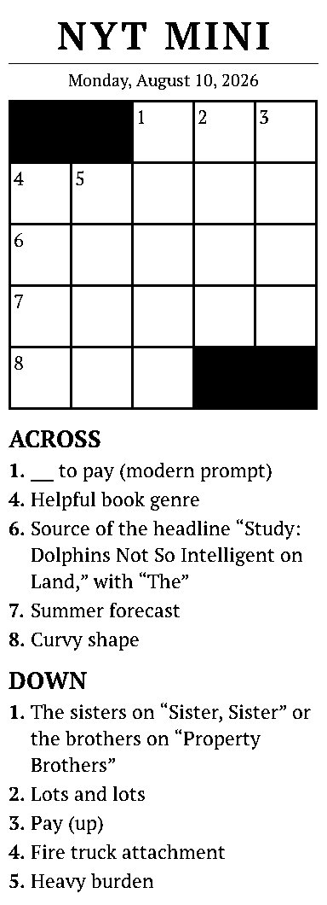

# nyt-mini-thermal-printer

Renders the day's NYT Mini crossword as a 1-bit PNG that has been optimized for a thermal printer. It defaults to rendering to 384px wide by default for the "Cat Printer" which takes 58mm paper, but the output width can be customized for printers with higher DPIs.

<p align="center">
  
</p>

<p align="center">
  <em>Output of <code>nyt-mini -date 2026-08-10</code>.</em>
</p>

## Install

```
go install github.com/Chriscbr/nyt-mini-thermal-printer/cmd/nyt-mini@latest
```

The binary is named after its package directory, so `cmd/nyt-mini` is what
makes the installed command `nyt-mini`.

## Usage

```
nyt-mini                      # today's mini -> nyt-mini-YYYY-MM-DD.png
nyt-mini -answers             # append the answer key
nyt-mini -width 576           # different printer width
nyt-mini -out - | your-printer-tool
```

| Flag | Default | Meaning |
| --- | --- | --- |
| `-date` | today, US Eastern | puzzle date, `YYYY-MM-DD` |
| `-width` | `384` | output width in pixels; everything scales from it |
| `-out` | `nyt-mini-<date>.png` | output path, or `-` for stdout |
| `-answers` | off | append a filled answer grid |

## Development

### About the puzzle endpoint

Puzzles come from thewordfinder.com's API:

```
https://api.thewordfinder.com/crossword-solver/nyt-mini/<date>?dates=1
```

It needs no credentials and serves the archive as readily as today, so `-date`
works for any past puzzle. The response carries both the clue list and the grid
geometry (which squares are blocks, their numbering, and the solution letters).
`dates=1` trims an archive index the API otherwise bundles into every response.

Two quirks worth knowing, both handled in `puzzle.go`:

- **Grid geometry only goes back to 2025-09-02.** Older entries still have
  clues and answers, but nothing saying where the blocks go, so there is no
  grid to draw. Those dates fail with an explicit error.
- **Unknown dates return HTTP 200 with today's puzzle**, rather than a 404. The
  fetch compares `puzzle_date` against what was asked for and rejects a
  mismatch before it can reach the cache.

The API exposes no constructor name, so the byline the NYT feed used to supply
is gone; the layout just omits it.

Fetched JSON is cached under `~/Library/Caches/nyt-mini-thermal-printer` (or
`$XDG_CACHE_HOME`), so re-rendering a day at a different width never re-hits the
network. Delete a file there to force a refetch.

### Output

A palette PNG with two colors, so it is genuinely 1 bit per pixel — feed it
straight to a printer tool without an extra dithering or threshold pass.

### Fonts

The Times sets its headlines in Cheltenham and its body text in Imperial, both
proprietary. This embeds PT Serif (SIL OFL, license in `fonts/`) instead — a
transitional serif sturdy enough to survive 1-bit thresholding at small sizes.
Type sizes live at the top of `Render` in `render.go` if you want them bigger
or smaller still.
